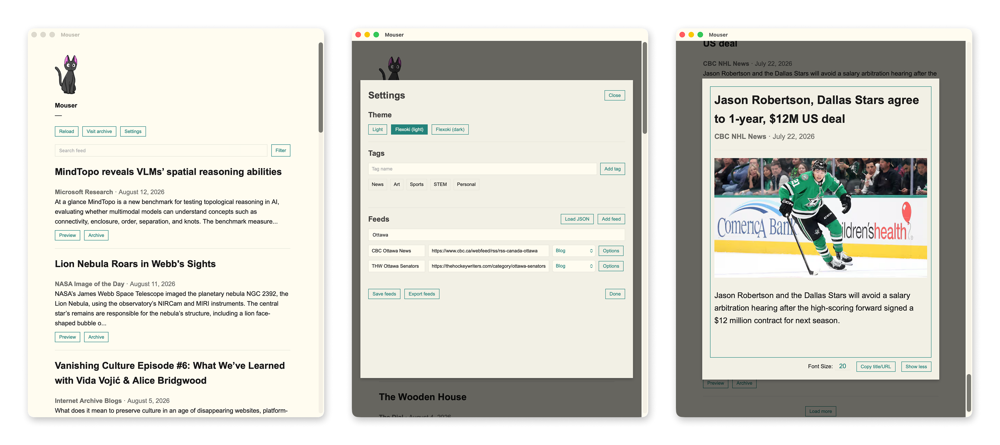

# Mouser

Mouser is a personal RSS, Atom, Substack, and YouTube reader packaged as a lightweight Tauri desktop app for macOS. It uses the operating system's native WebView and a Rust backend; it does not run a local HTTP server or require the project directory at runtime.



## Features

- Date-ordered feed and archive views backed by a paginated SQLite article cache
- Concurrent background refresh with HTTP caching for unchanged feeds
- Search across cached article titles, authors, and descriptions
- User-defined, multi-tag feed organization and combined tag filtering
- Feed-management search for large source lists
- JSON import and export of feeds, custom tags, and tag assignments
- Original articles in the default browser and an in-app reader through **Preview**
- Inline YouTube playback in the native WebView
- Light, Flexoki (light), and Flexoki (dark) themes

## Reading articles

On launch, Mouser immediately queries the newest 20 cached articles from SQLite. It then refreshes every configured feed concurrently in the background and updates the visible page when synchronization finishes. Each feed response contributes up to 10 recent entries to the cache. A first launch must download the feeds before articles can appear; later launches can display cached articles without waiting for the network.

**Load more** requests another 20 date-ordered articles directly from SQLite. Once SQLite is exhausted, loading stops because RSS does not provide a standard way to request entries that are no longer present in a publisher's feed.

While the app remains open, it refreshes feeds every 15 minutes. **Reload** triggers the same synchronization manually.

Clicking an article title opens the original URL in the system's default browser. **Preview** opens the article or video in Mouser's reader, where the font size can be adjusted and the title and URL can be copied.

## Search and filtering

The main search field searches the complete cached feed or archive rather than only the currently visible page. Search can be combined with tag filters.

Select **Filter** beside the search field to show the available feed tags. Selecting one tag shows articles from feeds carrying that tag; selecting several shows articles matching any selected tag. Deselect every tag to return to the complete feed.

**Misc.** is the built-in category for feeds without custom tags. It is implicit and does not appear in the editable custom-tag list. A feed with one or more custom tags is no longer part of **Misc.**

## Feeds and tags

Manage themes, tags, and feeds from **Settings**. A fresh installation starts with an empty feed list, and changes do not require rebuilding the app.

Custom tags are created in the **Tags** section. Each feed can have multiple tags. Open a feed's **Options**, type into **Add tags**, and choose existing matches from the typeahead. Unknown tag names are rejected; assign several tags as a comma-separated list and select **Save tags**. The expanded options also contain **Delete feed**.

The **Search feeds** field filters the settings list by the visible feed values. **Add feed** creates a new row for an RSS/blog or YouTube source. YouTube channel IDs and channel URLs are resolved to the channel's RSS feed when the configuration is saved.

Tag names are case-insensitively unique, cannot contain commas, and can contain at most 40 characters. A configuration supports up to 100 custom tags. **Misc.** is reserved and cannot be created manually.

## Import and export

**Export feeds** copies the currently saved feed configuration to the macOS Downloads folder as `mouser-feeds-<timestamp>.json`. The export contains custom tags and every feed's tag assignments. Unsaved settings edits are not included.

**Load JSON** validates a selected file and loads it into the settings form. This replaces only the unsaved settings shown in the modal; the saved feed configuration and existing article cache remain untouched until **Save feeds** is selected. The imported JSON must be smaller than 5 MB.

The current configuration format is:

```json
{
  "tags": ["Tech", "Culture"],
  "feeds": [
    {
      "name": "Blog name",
      "rss": "https://example.com/feed.xml",
      "type": "blog",
      "tags": ["Tech"]
    },
    {
      "name": "Channel name",
      "rss": "https://www.youtube.com/feeds/videos.xml?channel_id=<channel-ID>",
      "type": "youtube",
      "tags": ["Culture", "Tech"]
    },
    {
      "name": "Untagged source",
      "rss": "https://example.org/atom.xml"
    }
  ]
}
```

`type` defaults to `blog`, and `tags` defaults to an empty list. A feed's assigned tags must also exist in the top-level `tags` list. Legacy JSON consisting of a top-level feed array is still accepted; any tags on those feeds are used to construct the custom-tag list.

## Archive lifecycle

Archiving an article removes it from the main feed and places it in the archive. An archived article can be:

- **Reinstated**, returning it to the main feed.
- **Deleted** immediately from the archive.
- Automatically deleted after seven days on the next launch or refresh.

Deleted article content is removed from SQLite. A small tombstone containing only its ID is retained for 90 days so an item still present in an RSS response is not immediately inserted again.

Unarchived articles that have not appeared in a feed response for 90 days are pruned. Articles still present in a feed have their `last_seen_at` value refreshed and remain cached.

## Themes and interface

Mouser uses Arial throughout the interface. **Light** is the default theme. Settings also provides **Flexoki (light)** and **Flexoki (dark)**, based on the [Flexoki color scheme](https://stephango.com/flexoki). Headings use each theme's primary text color, while buttons and links use the theme accent color. Selected theme buttons remain visually stable on hover.

## Storage

Application data is stored outside the repository at:

```text
~/Library/Application Support/<app-bundle-identifier>/feeds.json
~/Library/Application Support/<app-bundle-identifier>/archive.sqlite3
```

`feeds.json` contains the saved feed and tag configuration. Despite its historical filename, `archive.sqlite3` contains the article cache, archive state, feed HTTP validators, and deletion tombstones. Legacy feed configurations remain readable, and existing databases are migrated in place when the app launches.

## Development

Install the JavaScript dependencies once:

```sh
npm install
```

Run the development app:

```sh
npm run dev
```

The development command opens the native Tauri app, not a standalone browser version. Application data remains in the macOS Application Support directory rather than the repository.

Run the Rust tests with:

```sh
cargo test --manifest-path src-tauri/Cargo.toml
```

## Build and install

Build the release app:

```sh
npm run build
```

On macOS, the bundle is created at:

```text
src-tauri/target/release/bundle/macos/Mouser.app
```

Quit Mouser, then replace the installed copy with:

```sh
ditto src-tauri/target/release/bundle/macos/Mouser.app /Applications/Mouser.app
```

Because the Dock item points to `/Applications/Mouser.app`, replacing the bundle at that path makes the new build live without unpinning and repinning it.

## Architecture

- `templates/index.html`: bundled WebView interface, styling, settings, search, tag filtering, and article reader
- `templates/assets/mouser-logo.png`: bundled header logo
- `src-tauri/src/lib.rs`: feed synchronization and parsing, configuration validation and persistence, SQLite pagination and archive lifecycle, feed export, and native commands
- `src-tauri/build.rs`: build-time command manifest and default-feed embedding
- `src-tauri/tauri.conf.json`: macOS window and application-bundle configuration
- `src-tauri/capabilities/` and `src-tauri/permissions/`: restricted IPC access for the bundled interface

On macOS, the interface is loaded with the installed app's bundle identifier as its WebView base URL. This gives YouTube embeds a stable origin in release builds without introducing a localhost server. Static frontend files, including the header logo, are served through Tauri's bundled-asset protocol.
